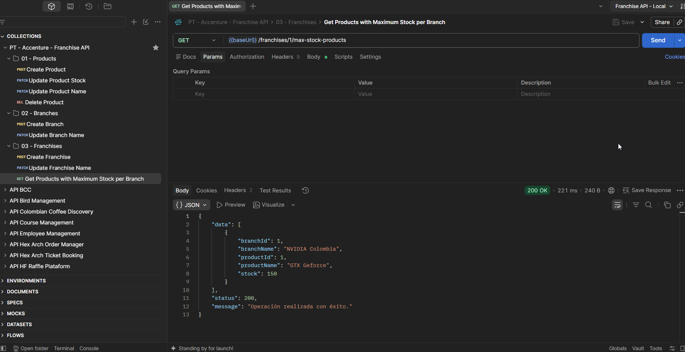
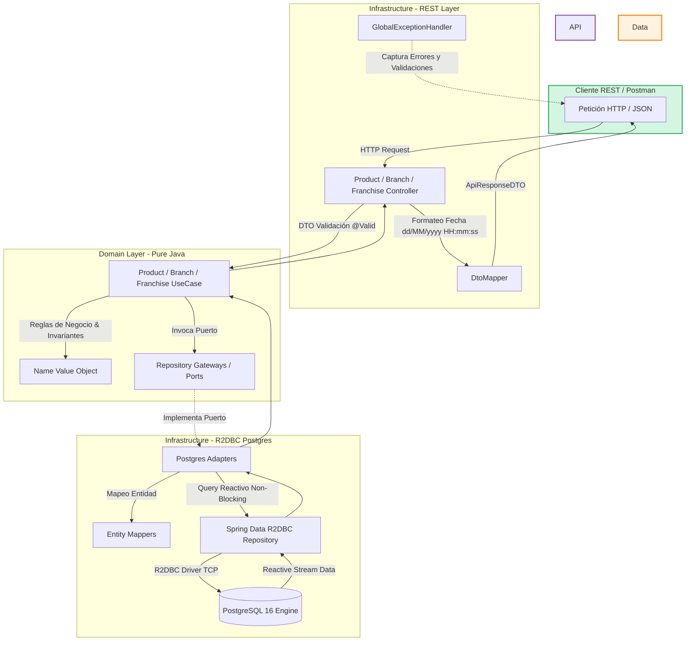

# 📖 GUÍA RÁPIDA DEL PROYECTO: ACCENTURE FRANCHISE API 🏛️
Este proyecto es una **API RESTful Reactiva de Alta Concurrencia** desarrollada en **Java 21** y **Spring Boot 3** bajo 
**Arquitectura Hexagonal (Ports & Adapters)** para la gestión integral de franquicias, sucursales y control de inventario 
de productos en tiempo real.

La solución implementa programación reactiva no bloqueante con **Spring WebFlux** y **Spring Data R2DBC**, persistencia 
en **PostgreSQL**, contenedorización completa con **Docker**, automatización de tareas con **Make** y una suite 
exhaustiva de pruebas unitarias con **JaCoCo** superando el 85% de cobertura de código.

**_Autor: Saul Echeverri_**   
_Edición: 2026_



## Comenzando 🚀
El propósito del proyecto es dar solución a la prueba técnica de la empresa **Accenture**, demostrando la implementación 
de un microservicio robusto, desacoplado y reactivo, aplicando:
* **Arquitectura Hexagonal (Ports & Adapters):** Dominio 100% puro aislado de frameworks externos.
* **Programación Funcional y Reactiva:** Uso de pipelines reactivos no bloqueantes con Project Reactor (`Mono` y `Flux`).
* **Clean Code & Principios SOLID:** Inmutabilidad con `@Value` y `@Builder`, Value Objects (`Name`), encapsulamiento y DTOs independientes.
* **Infraestructura como Código y Contenerización:** Orquestación con `docker-compose.yml`, multi-stage `Dockerfile` y automatización con `Makefile`.

---
## 1. REQUISITOS DEL SISTEMA ⚙️
Para ejecutar este proyecto de forma local o contenerizada, necesitas los siguientes componentes:

### Requisitos Previos 🔧
Antes de comenzar, asegúrate de tener los siguientes requisitos previos en tu sistema:
* **Java Development Kit (JDK):** Versión 21 (Eclipse Temurin / Amazon Corretto).
* **Gradle:** Wrapper incluido en el repositorio (`./gradlew`).
* **PostgreSQL:** Versión 16+ (puerto `5432`).
* **Docker Desktop:** Para ejecución contenerizada con Docker y Docker Compose.
* **Make:** Para automatización de comandos en terminal.
* **Git:** Para clonación y control de versiones.

Verifica tu versión de Java y Docker:
```shell
java -version
docker --version
```
#### Clonar el Repositorio
Para comenzar, clona este repositorio en tu máquina local usando Git:

```shell
git clone https://github.com/saulolo/franchise-api.git
cd franchise-api
```

## Despliegue y Ejecución📦
En esta sección, se proporcionan instrucciones y notas adicionales sobre cómo llevar tu proyecto a un entorno de
producción o cómo desplegarlo para su uso.

### Despliegue Local 🏠
**Opción A**: Despliegue Automatizado con Docker y Make (Recomendada)
#### 1. Construir imágenes y levantar servicios en segundo plano
```shell
make run-build
```
#### 2. Ver logs en tiempo real
```shell
make logs
```
#### 3. Consultar endpoints y estado del sistema
```shell
make info
make endpoints
```
#### 4. Detener contenedores
```shell
make stop
```

**Opción B**: Despliegue Local Nativo (Sin Docker)
#### 1. Configurar PostgreSQL:
Asegúrate de que PostgreSQL esté corriendo en el puerto 5432 y crea la base de datos:
```sql
CREATE DATABASE franchise_accenture_db;
```
#### Configuración de Variables de Entorno (.env):
Copia la plantilla .env.example a .env en la raíz del proyecto y ajusta tus credenciales locales:
```shell
SPRING_APPLICATION_NAME=franchise-api
SPRING_PROFILES_ACTIVE=local
SERVER_PORT=9090
SERVER_SERVLET_CONTEXT_PATH=/accenture
SPRING_R2DBC_URL=r2dbc:postgresql://localhost:5432/franchise_accenture_db
SPRING_R2DBC_USERNAME=postgres
SPRING_R2DBC_PASSWORD=tu_password
SPRING_SQL_INIT_MODE=always
SPRING_TIMEZONE=America/Bogota
```
#### 3. Compilación y Ejecución:
```shell
./gradlew bootRun
```
#### La API estará disponible en la ruta base:
```shell
http://localhost:9090/accenture/api/v1
```

### 🧩 Script SQL para la Base de Datos
- El microservicio ejecuta automáticamente el script DDL al arrancar; esta ubicado en: 
- `src/main/resources/db/schema.sql`

```sql
CREATE TABLE IF NOT EXISTS franchises (
    id BIGSERIAL PRIMARY KEY,
    name VARCHAR(30) NOT NULL UNIQUE,
    created_at TIMESTAMP NOT NULL,
    updated_at TIMESTAMP NOT NULL
    );

CREATE TABLE IF NOT EXISTS branches (
    id BIGSERIAL PRIMARY KEY,
    franchise_id BIGINT NOT NULL,
    name VARCHAR(30) NOT NULL,
    created_at TIMESTAMP NOT NULL,
    updated_at TIMESTAMP NOT NULL,
    CONSTRAINT fk_franchise FOREIGN KEY (franchise_id) REFERENCES franchises(id) ON DELETE CASCADE
    );

CREATE TABLE IF NOT EXISTS products (
    id BIGSERIAL PRIMARY KEY,
    branch_id BIGINT NOT NULL,
    name VARCHAR(30) NOT NULL,
    stock INT NOT NULL DEFAULT 0,
    created_at TIMESTAMP NOT NULL,
    updated_at TIMESTAMP NOT NULL,
    CONSTRAINT fk_branch FOREIGN KEY (branch_id) REFERENCES branches(id) ON DELETE CASCADE
    );
```
📌 **Instrucciones para ejecutarlo desde DBeaver (PostgreSQL):**
1. Abre DBeaver y conéctate a tu servidor de PostgreSQL.
2. Si no existe la base de datos `franchise_accenture_db`, créala:
- Haz clic derecho sobre el servidor > **Create > Database**
- Nómbrala: `franchise_accenture_db`

---
## 2. ESTRUCTURA DEL PROYECTO 🏗️
El proyecto sigue una arquitectura hexagonal para organizar las responsabilidades de cada clase, lo que facilita el 
mantenimiento y la escalabilidad.

```ja
franchise-api/
├── src/
│   ├── main/
│   │   ├── java/com/accenture/franchise/
│   │   │   ├── application/
│   │   │   │   └── config/                 
│   │   │   ├── domain/
│   │   │   │   ├── gateway/                
│   │   │   │   ├── model/                  
│   │   │   │   │   ├── exception/          
│   │   │   │   │   └── vob/                
│   │   │   │   └── usecase/                
│   │   │   ├── infrastructure/
│   │   │   │   ├── adapter/postgres/       
│   │   │   │   └── entrypoints/rest/       
│   │   │   └── shared/utils/               
│   │   └── resources/
│   │       ├── db/schema.sql               
│   │       ├── application.properties      
│   │       └── banner.txt                  
│   └── test/java/com/accenture/franchise/  
├── docs/                                   
├── Dockerfile                              
├── docker-compose.yml                      
├── Makefile                                
└── build.gradle                            
```

- `application/`: Capa de configuración e inyección de dependencias de Spring Boot.
- `config/`: Registra los casos de uso como Beans gestionados sin acoplar el dominio al framework.
- `domain/`: Núcleo puro de la aplicación que contiene las reglas de negocio independientes de frameworks.
- `gateway/`: Define los puertos (interfaces) para la persistencia y comunicación con el exterior.
- `model/`: Modela las entidades de negocio inmutables del dominio (Franchise, Branch, Product).
- `exception/`: Define las excepciones personalizadas del negocio (ResourceNotFound, BusinessRules).
- `vob/`: Contiene los Value Objects inmutables con auto-validación de reglas (Name).
- `usecase/`: Orquesta la lógica del negocio mediante pipelines reactivos con Project Reactor (Mono y Flux).
- `infrastructure/`: Implementa los adaptadores técnicos, persistencia en base de datos y puntos de entrada HTTP.
- `adapter/postgres/`: Implementa la persistencia reactiva en PostgreSQL con Spring Data R2DBC, entidades y mappers.
- `entrypoints/rest/`: Expone los controladores REST, DTOs de request/response y el manejador global de errores.
- `shared/utils/`: Utilitarios y constantes transversales en Java puro accesibles por todas las capas.
- `resources/`: Archivos de configuración, scripts de inicialización y recursos de la aplicación.
- `db/schema.sql`: Script DDL para la creación automática de tablas, llaves foráneas e índices en PostgreSQL.
- `application.properties`: Configuración de propiedades, perfiles de entorno y parámetros de conexión R2DBC.
- `banner.txt`: Banner visual en arte ASCII personalizado que se muestra al arrancar el microservicio.
- `test/`: Suite de pruebas unitarias reactivas implementadas con JUnit 5, Mockito y StepVerifier.
- `docs/`: Documentación técnica, diagramas PlantUML y colección de pruebas exportada de Postman.
- `Dockerfile`: Archivo de construcción multi-stage para empaquetar la aplicación en una imagen ligera de Java 21.
- `docker-compose.yml`: Orquestador de contenedores para levantar la API y la base de datos PostgreSQL en red aislada.
- `Makefile`: Automatización de comandos de desarrollo, ejecución, pruebas, cobertura y gestión de base de datos.
- `build.gradle`: Configuración del proyecto, gestión de dependencias Gradle y reporte de cobertura con JaCoCo.

---

## 3. ESPECIFICACIONES TÉCNICAS Y REQUERIMIENTOS 📋

El proyecto fue desarrollado siguiendo los siguientes requerimientos técnicos:

* **Arquitectura**: Patrón **Modelo-Vista-Controlador (MVC)**. ✅
* **Base de datos**: **PostgreSQL** con **ORM** (JPA/Hibernate). ✅
* **Ruta base de la API**: `/airline`. ✅
* **Puerto de la aplicación**: `8085`. ✅
* **Manejo de errores**: Control de excepciones personalizadas. ✅
* **Seguridad**: Protección contra **SQL Injection**. ✅
* **Logging**: Registro de cada transacción del API. ✅
* **Pruebas**: **Pruebas unitarias** con al menos un **50% de cobertura**. ✅
* **Estructura de la respuesta**: ✅
```json
{
  "data": null,
  "status": "success",
  "message": ""
}
```

---

## 4. ENDPOINTS DE LA API REST 🌐
Todos los endpoints están mapeados bajo el prefijo: `http://localhost:9090/accenture/api/v1`

| Módulo          | Método   | Endpoint                                     | Descripción                                   | Status        |
|:----------------|:---------|:---------------------------------------------|:----------------------------------------------|:--------------|
| **Franquicias** | `POST`   | `/franchises`                                | Crear una nueva franquicia                    | `201 Created` |
| **Franquicias** | `PATCH`  | `/franchises/{id}/name`                      | Actualizar nombre de franquicia               | `200 OK`      |
| **Franquicias** | `GET`    | `/franchises/{id}/max-stock-products`        | Producto con mayor stock por cada sucursal    | `200 OK`      |
| **Sucursales**  | `POST`   | `/franchises/{franchiseId}/branches`         | Agregar una nueva sucursal a la franquicia    | `201 Created` |
| **Sucursales**  | `PATCH`  | `/branches/{id}/name`                        | Actualizar nombre de la sucursal              | `200 OK`      |
| **Productos**   | `POST`   | `/branches/{branchId}/products`              | Agregar un nuevo producto a la sucursal       | `201 Created` |
| **Productos**   | `PATCH`  | `/products/{id}/stock`                       | Modificar la cantidad de stock de un producto | `200 OK`      |
| **Productos**   | `PATCH`  | `/products/{id}/name`                        | Actualizar el nombre de un producto           | `200 OK`      |
| **Productos**   | `DELETE` | `/branches/{branchId}/products/{productId}`  | Eliminar un producto de una sucursal          | `200 OK`      |

### Formato Estándar de Respuesta (JSON)

```json
{
  "data": {
    "id": 1,
    "name": "Nvidia Corporation",
    "createdAt": "31/08/2026 14:00:00",
    "updatedAt": "31/08/2026 14:00:00"
  },
  "status": 200,
  "message": "Operación realizada con éxito."
}

```

### Flujo reactivo de la arquitectura hexagonal 📊


El flujo del proyecto sigue estrictamente el principio de **inversión de dependencias de la Arquitectura Hexagonal 
(Ports & Adapters)**, dividiéndose en tres capas claramente diferenciadas: **los adaptadores de entrada 
(REST Entrypoints)**, **el núcleo de negocio puro (Domain UseCases & Value Objects)** y **los adaptadores de salida 
(Persistencia R2DBC & PostgreSQL)**.

La capa REST recibe las solicitudes del cliente y las valida; el caso de uso ejecuta las reglas de negocio de forma 
reactiva y no bloqueante, comunicándose con la base de datos únicamente a través de contratos desacoplados (puertos o gateways).

### Flujo del Proceso de la API 🚀
1. **Inicio (Petición HTTP):** Un cliente (como Postman, Angular o una app móvil) envía una solicitud HTTP (`GET`, `POST`, `PATCH`, `DELETE`) a uno de los endpoints de la API, por ejemplo: `POST /accenture/api/v1/branches/1/products`.
2. **Llegada al Adaptador de Entrada (Controlador REST):** El controlador correspondiente (`ProductController`, `BranchController` o `FranchiseController`) intercepta la solicitud, extrae el cuerpo del JSON y valida los campos de entrada mediante las anotaciones `@Valid` de Jakarta Validation.
3. **Ejecución de la Lógica de Negocio (Caso de Uso):** El controlador delega la ejecución al Caso de Uso (`ProductUseCase`). En este punto se aplican las reglas puras del negocio y la integridad del dominio mediante **Value Objects** (como `Name`, validando entre 3 y 30 caracteres sin números) y validaciones de stock no negativo.
4. **Desacoplamiento mediante Puertos (Gateways):** El caso de uso no conoce la base de datos; simplemente interactúa con la interfaz reactiva del puerto (`ProductRepositoryGateway` o `BranchRepositoryGateway`).
5. **Adaptador de Persistencia y Comunicación No Bloqueante (R2DBC):** El adaptador de infraestructura (`ProductPostgresAdapter`) implementa el puerto, transforma el modelo de dominio en entidad de base de datos (`ProductEntity`) mediante `ProductMapper`, y ejecuta la consulta SQL reactiva a través del repositorio R2DBC sobre **PostgreSQL 16**.
6. **Mapeo y Formateo de Datos:** PostgreSQL emite el flujo de datos reactivo (`Mono` / `Flux`). El adaptador convierte la entidad de regreso a un modelo de dominio inmutable. Al llegar al controlador, el **`DtoMapper`** lo transforma en un DTO de respuesta (`ProductResponseDTO`), aplicando el formato estándar de fecha (`dd/MM/yyyy HH:mm:ss`).
7. **Respuesta Estandarizada al Cliente:** Finalmente, el controlador envuelve los datos en el contenedor genérico **`ApiResponseDTO`** con la estructura unificada `{ data, status, message }` y responde al cliente con el código HTTP correspondiente (`200 OK`, `201 Created`, etc.).
    
### Resumen del Flujo del Proceso de la API :
`Cliente` ➡️ `RestController (Entrypoint)` ➡️ `UseCase (Dominio)` ➡️ `Gateway (Puerto)` ➡️ `Adapter (R2DBC)` ➡️ `PostgreSQL` ➡️ `Adapter` ➡️ `UseCase` ➡️ `DtoMapper` ➡️ `RestController` ➡️ `Cliente`

---

## 5. TESTING Y COBERTURA DE CÓDIGO (JACOCO) 🧪
El proyecto incluye pruebas unitarias completas utilizando **JUnit 5** , **Mockito** y **StepVerifier** para validar 
flujos reactivos.

Para ejecutar las pruebas y abrir el reporte de cobertura:

```shell
# Con Make:
make full-coverage

# O con Gradle directamente:
./gradlew test jacocoTestReport
```
El reporte HTML se genera automáticamente en:  
`build/reports/jacoco/index.html`

---

## 6. ESPECIFICACIONES TÉCNICAS Y CRITERIOS DE ACEPTACIÓN 📋
- [x] **Arquitectura:** Arquitectura Hexagonal estricta (Ports & Adapters) sin dependencias de frameworks en la capa de dominio.
- [x] **Programación Reactiva:** Flujos asíncronos y no bloqueantes con Spring WebFlux, Spring Data R2DBC y Project Reactor (`Mono` y `Flux`).
- [x] **Base de Datos:** Persistencia en PostgreSQL 16 utilizando el driver reactivo R2DBC y script DDL `schema.sql` automático.
- [x] **Formato de Fechas:** Serialización estandarizada de timestamps con formato `dd/MM/yyyy HH:mm:ss`.
- [x] **Validaciones de Negocio:** Value Object `Name` (3 a 30 caracteres, solo texto alfabético sin números) y validaciones Jakarta en DTOs de entrada.
- [x] **Inyección de Dependencias:** Gestión desacoplada mediante `@Configuration` en `BeanConfiguration` (sin anotaciones `@Service` en casos de uso).
- [x] **Manejo Global de Errores:** `GlobalExceptionHandler` unificado con estructura de respuesta estándar `ApiResponseDTO` `{ data, status, message }`.
- [x] **Contenerización y DevOps:** Multi-stage `Dockerfile` en Java 21, orquestación con `docker-compose.yml` y automatización mediante `Makefile`.
- [x] **Cobertura de Pruebas:** Suite de pruebas unitarias con JUnit 5, Mockito y StepVerifier alcanzando más del 85% de cobertura con JaCoCo.

---

## Autor ✒️
¡Hola! Soy **Saul Echeverri Duque** 👨‍💻 , el creador y desarrollador de este proyecto. Permíteme compartir un poco sobre mi
formación y experiencia:

### Formación Académica 📚
- 📖 Titulado en Tecnología en Análisis y Desarrollo de Software por el SENA.
- 🎓 Graduado en Ingeniería de Alimentos por la Universidad de Antioquia, Colombia.
- 👨‍💻 Más de 3 años de experiencia en desarrollo de microservicios con Java, Spring Boot y bases de datos relacionales.

### Trayectoria Profesional 💼
Desarrollador de Software con mentalidad analítica y sólida experiencia en el diseño, desarrollo y optimización de 
microservicios escalables con **Java**, **Spring Boot** y arquitecturas Cloud en **AWS**.

A lo largo de mi carrera, he aportado valor técnico en diversas empresas del sector tecnológico y financiero:

* 🏢 **[IAS Software](https://www.ias.com.co/) | Desarrollador de Software Full Stack**
* 🏢 **[Cidenet](https://cidenet.net/) | Analista de Desarrollo** 
* 🏢 **Convertic | Analista de Desarrollo** 


### Pasión por la Programación 🚀
- 💻 Mi viaje en el mundo de la programación comenzó en el 2021, y desde entonces, he estado inmerso en el emocionante
  universo del desarrollo de software.
- 📚 Uno de mis mayores intereses y áreas de enfoque es **Java**, y este proyecto es el resultado de mi deseo de compartir
  conocimientos y experiencias relacionadas con este lenguaje.

  
## Expresiones de Gratitud 🎁

Quiero expresar mi más sincero agradecimiento a la empresa [Accenture](https://www.accenture.com/co-es) por la oportunidad 
de participar en este ejercicio técnico. Este proyecto me ha permitido aplicar conceptos avanzados de Arquitectura 
Hexagonal, programación reactiva no bloqueante con R2DBC y contenerización profesional con Docker y Make.
La experiencia ha sido invaluable para mi crecimiento profesional.

## Créditos y Contacto 📜
Este proyecto fue desarrollado por [Saul Echeverri](https://github.com/saulolo).

Agradezco sinceramente el tiempo dedicado a la revisión de este proyecto. Valoro profundamente cualquier feedback técnico 
sobre las decisiones de arquitectura, diseño reactivo y buenas prácticas aplicadas. Quedo a total disposición para 
profundizar en cualquier detalle de la implementación durante el espacio de sustentación técnica:
- GitHub: [https://github.com/saulolo](https://github.com/saulolo) 🌐
- Correo Electrónico: [saulolo@gmail.com](saulolo@gmail.com) 📧
- LinkedIn: [https://www.linkedin.com/in/saul-echeverri-duque/](https://www.linkedin.com/in/saul-echeverri-duque/) 💼

---
### METADATOS DEL DOCUMENTO 📄


| Campo                    | Detalles                                                                                                   |
|:-------------------------|:-----------------------------------------------------------------------------------------------------------|
| **Título**               | GUÍA RÁPIDA DEL PROYECTO: ACCENTURE FRANCHISE API                                                          |
| **Autor(es)**            | Saul Echeverri                                                                                             |
| **Versión**              | 1.0.0                                                                                                      |
| **Fecha de Creación**    | 29 de Agosto de 2026                                                                                       |
| **Última Actualización** | 29 de Agosto de 2026                                                                                       |
| **Notas Adicionales**    | Documento base para referencia rápida del proyecto de API RESTful Reactivo para la gestión de franquicias. |

---

